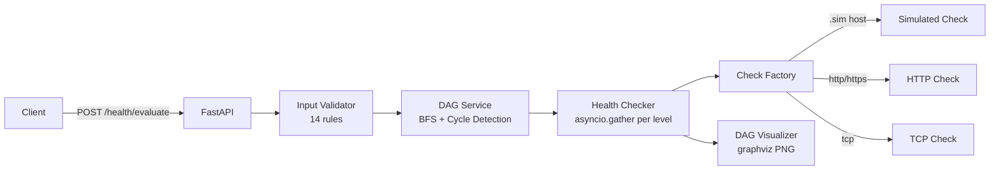

# Health Check API

A Python API for evaluating the health of system components arranged as a **Directed Acyclic Graph (DAG)**.

## Features

- 🔗 **DAG-based health modelling** — components and their dependencies form a DAG
- ⚡ **Async evaluation** — BFS traversal with `asyncio.gather` for concurrent checks per level
- 🔴 **DAG visualization** — PNG image with unhealthy components highlighted in red
- 🌡️ **Health propagation** — unhealthy dependencies degrade their parents
- ✅ **14-rule input validation** — comprehensive error messages with machine-readable codes
- 📊 **Observability** — structured JSON logging, Prometheus metrics, OpenTelemetry tracing
- 🐳 **Docker-ready** — multi-stage build, non-root, < 200MB
- ☁️ **GCP-native** — Cloud Run + Terraform IaC

## Quick Start

### Local (Python)

```bash
# Install uv
curl -LsSf https://astral.sh/uv/install.sh | sh

# Install dependencies
uv venv && uv pip install -e ".[dev]"

# Run the API
source .venv/bin/activate
uvicorn app.main:app --reload --port 8080
```

### Docker

```bash
docker build -t healthcheck-api .
docker run -p 8080:8080 healthcheck-api
```

### Docker Compose

```bash
docker-compose up
```

## API Endpoints

| Method | Path | Description |
|--------|------|-------------|
| `GET` | `/health` | Liveness check |
| `POST` | `/health/evaluate` | Evaluate DAG health |
| `POST` | `/dag/visualize` | Render DAG as PNG |
| `GET` | `/metrics` | Prometheus metrics |
| `GET` | `/docs` | OpenAPI (Swagger UI) |

## Sample Request

> **Note**: Commands using `@tests/fixtures/...` must be run from the project root directory.

```bash
# Evaluate DAG health
curl -X POST http://localhost:8080/health/evaluate \
  -H "Content-Type: application/json" \
  -d @tests/fixtures/sample_dag.json

# Render DAG as PNG
curl -X POST http://localhost:8080/dag/visualize \
  -H "Content-Type: application/json" \
  -d @tests/fixtures/sample_dag.json \
  --output dag.png
```

### Input JSON

```json
{
  "components": [
    { "id": "step-1", "name": "API Gateway",       "type": "gateway",  "endpoint": "http://api-gateway.sim/healthy" },
    { "id": "step-2", "name": "Auth Service",       "type": "service",  "endpoint": "http://auth-service.sim/healthy" },
    { "id": "step-4", "name": "Inventory Database", "type": "database", "endpoint": "tcp://inventory-db.sim:5432/unhealthy" }
  ],
  "edges": [
    ["step-1", "step-2"],
    ["step-2", "step-4"]
  ]
}
```

## Simulated Endpoints

Use `.sim` hostname suffix to simulate health checks without real infrastructure:

| Endpoint | Behavior |
|----------|----------|
| `http://svc.sim/healthy` | Returns HEALTHY (50–200ms) |
| `http://svc.sim/unhealthy` | Returns UNHEALTHY |
| `http://svc.sim/degraded` | Returns DEGRADED |
| `http://svc.sim/flaky?rate=0.3` | 30% chance of failure |
| `tcp://db.sim:5432/slow?latency=2000` | HEALTHY after 2s delay |
| `http://svc.sim/timeout` | Simulates timeout |

## Architecture



## Documentation

- [Architecture](docs/architecture.md)
- [API Reference](docs/api.md)
- [Design Decisions](docs/decisions.md)
- [Observability](docs/observability.md)
- [Deployment](docs/deployment.md)
- [SLOs](docs/slo.md)
