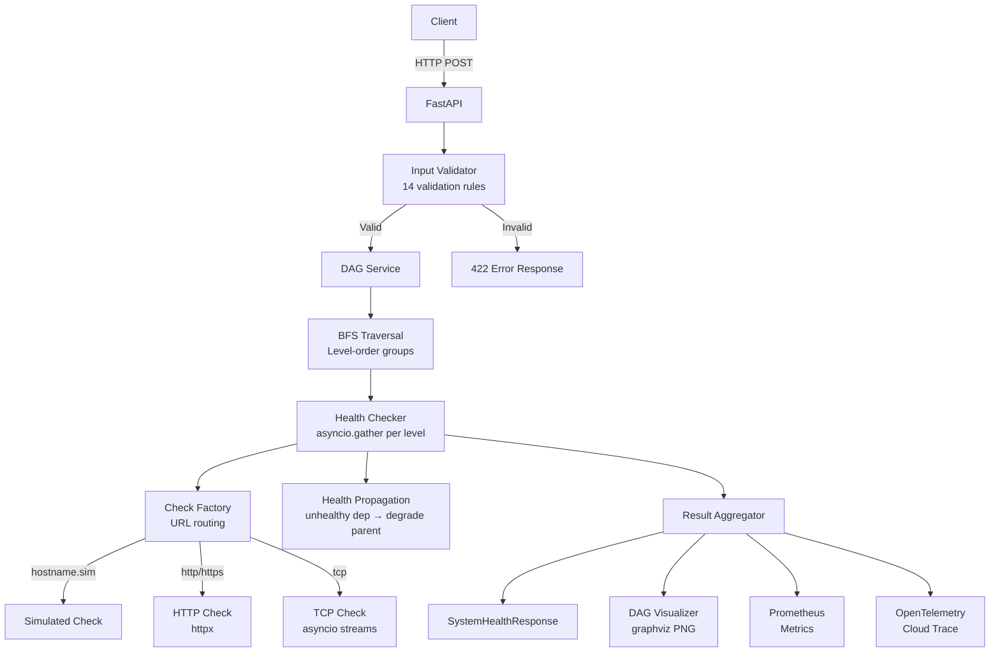
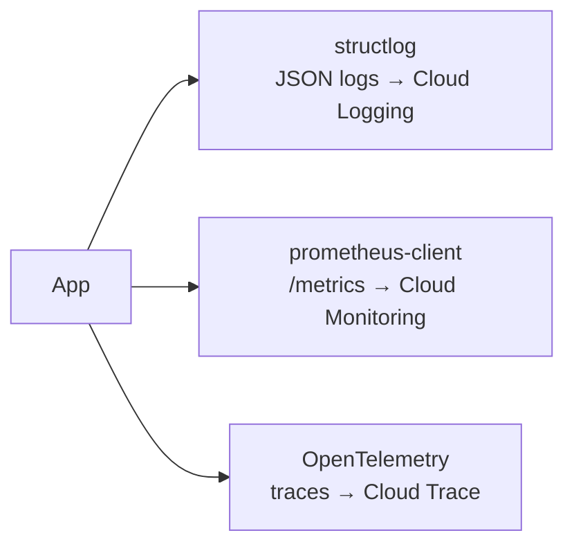

# Architecture

## System Overview

The Health Check API evaluates the health of a system described as a **Directed Acyclic Graph (DAG)** where nodes are components and edges represent dependency relationships.



## DAG Model

### Components
Each node in the DAG represents a system component with:
- **ID**: Unique alphanumeric identifier
- **Name**: Human-readable display name
- **Type**: Category (`service`, `database`, `cache`, `queue`, `gateway`, `external`, `custom`)
- **Endpoint**: URL for health checking (real or simulated)

### Edges
Directed edges represent **dependency relationships**: `(A, B)` means "A depends on B". The DAG captures upstream/downstream relationships.

### DAG Constraints
- Must be a valid Directed Acyclic Graph (no cycles)
- Validated using **Kahn's topological sort algorithm**
- Disconnected subgraphs are allowed (warned but not rejected)

## BFS Traversal Algorithm

BFS enables **concurrent evaluation of independent components**:

```
Level 0:  [API Gateway]                    ← 1 root node
Level 1:  [Auth Service]                   ← depends on level 0
Level 2:  [Order Service]                  ← depends on level 1
Level 3:  [Inventory DB, Payment Service]  ← both depend on level 2 (parallel)
Level 4:  [Payment Gateway, Notification]  ← parallel
Level 5:  [Email Queue, Session Cache]     ← parallel
Level 6:  [Analytics Pipeline]             ← depends on both level 5 nodes (diamond)
Level 7:  [Data Warehouse]                 ← leaf
```

All nodes within a single BFS level run concurrently via `asyncio.gather()`, minimising total evaluation time.

### Diamond Handling
When a node has multiple parents (e.g., step-10 depends on both step-8 and step-9), it is evaluated **exactly once** at the BFS level where all its parents have been visited. The `queued` set in `DAGService.bfs_levels()` prevents duplicate scheduling.

## Health Propagation

After each BFS level is evaluated, propagation rules apply:

| Own Status | Dependency Status | Final Status |
|-----------|------------------|--------------|
| HEALTHY   | HEALTHY          | HEALTHY      |
| HEALTHY   | DEGRADED         | HEALTHY      |
| HEALTHY   | UNHEALTHY        | **DEGRADED** |
| DEGRADED  | any              | DEGRADED     |
| UNHEALTHY | any              | UNHEALTHY    |

**Rule**: A component cannot be HEALTHY if any of its direct dependencies are UNHEALTHY. The message is annotated with `[degraded due to unhealthy dependency]`.

## Check Routing

The check strategy is determined purely from the endpoint URL:

```
endpoint URL
    │
    ├── hostname ends with ".sim"?
    │       YES → SimulatedHealthCheck (path controls behavior)
    │       NO  ↓
    │
    ├── scheme = "http" or "https"?
    │       YES → HttpHealthCheck (httpx GET)
    │
    └── scheme = "tcp"?
            YES → TcpHealthCheck (asyncio.open_connection)
```

## Component Types and Default Timeouts

| Type | Protocol | Timeout |
|------|---------|---------|
| service | http | 3s |
| database | tcp | 5s |
| cache | tcp | 2s |
| queue | tcp | 3s |
| gateway | http | 3s |
| external | http | 5s |
| custom | http | 3s |

## Observability Architecture



- **Logs**: Emitted as structured JSON to stdout, ingested by Cloud Run → Cloud Logging
- **Metrics**: Prometheus format scraped by Cloud Monitoring
- **Traces**: OpenTelemetry spans exported to GCP Cloud Trace
